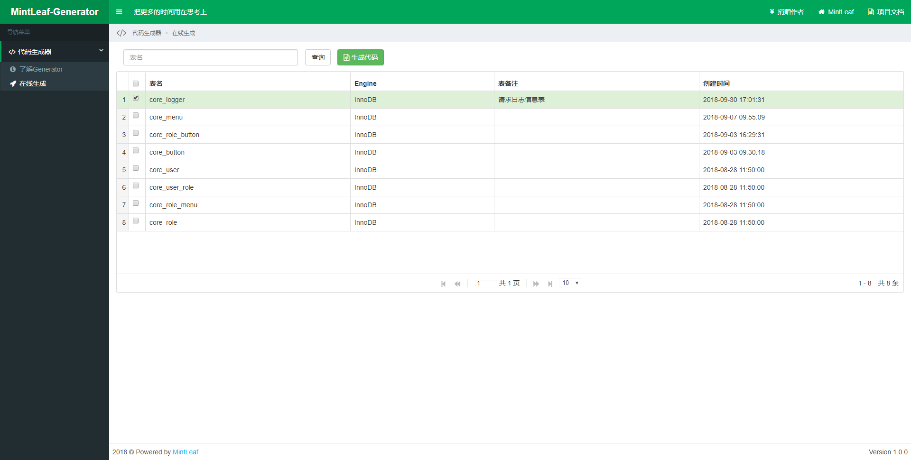

# 代码生成器

#### 项目介绍
Java代码生成器，通过构造自定义模板，可在线生成entity、xml、dao、service、html、js、sql代码，节省编写重复代码的时间，把更多的时间用在思考上

#### 软件架构
- 核心框架：Spring Boot
- 持久层框架：MyBatis
- 项目管理：Maven

#### 安装教程

1. 通过git下载源码
2. 修改application.yml，更新MySQL账号和密码、数据库名称
4. IDEA、Eclipse运行MintLeafApplication.java，则可启动项目
3. 项目访问路径：http://localhost:8060

#### 在线演示
- 演示地址：http://39.106.153.65:8060/#main.html

#### 演示效果图

#### 参与贡献

1. Fork 本项目
2. 新建 Feat_xxx 分支
3. 提交代码
4. 新建 Pull Request

#### 码云特技

1. 使用 Readme\_XXX.md 来支持不同的语言，例如 Readme\_en.md, Readme\_zh.md
2. 码云官方博客 [blog.gitee.com](https://blog.gitee.com)
3. 你可以 [https://gitee.com/explore](https://gitee.com/explore) 这个地址来了解码云上的优秀开源项目
4. [GVP](https://gitee.com/gvp) 全称是码云最有价值开源项目，是码云综合评定出的优秀开源项目
5. 码云官方提供的使用手册 [http://git.mydoc.io/](http://git.mydoc.io/)
6. 码云封面人物是一档用来展示码云会员风采的栏目 [https://gitee.com/gitee-stars/](https://gitee.com/gitee-stars/)
